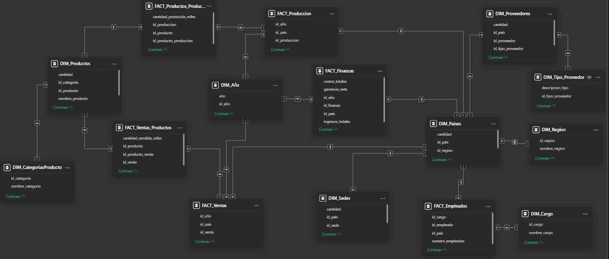

# Toyota-Dashboard-using-PowerBI-and-Excel
In this project (which Language is in Spanish), I've created Dashboards using fictional data about Toyota, this is a personal project about Business Intelligence and Data Analytics. Each one of the dashboards belong to the Balanced ScoreCard Analysis, evaluating the 4 perspectives:
### 1.Financial: ### Measures economic performance, such as revenue growth, ROI, and cost efficiency.(Finanzas)
### 2.Customer:### Evaluates customer satisfaction, loyalty, and market share.(Ventas)
### 3.Internal Processes:### Focuses on operational efficiency, quality, and cycle times.(Producción)
### 4.Learning & Growth:### Assesses employee training, culture, and technology infrastructure.(Empleados)
There are also 2 aditional Dashboards evaluating secondary information.

## 🏗️ Data Model

## 🛡️ License

This project is licensed under the [MIT License](LICENSE). You are free to use, modify, and share this project with proper attribution.

## 🌟 About Me

Hi there! I'm **Adrián Fajardo**. I’m a Future Systems Engineer who is looking to create, share and contribuite with amazing projects. The areas I want to specialize are data engineering and data analytics. Join me and let's learn together.

Let's stay in touch! Feel free to connect with me on the following platforms:

